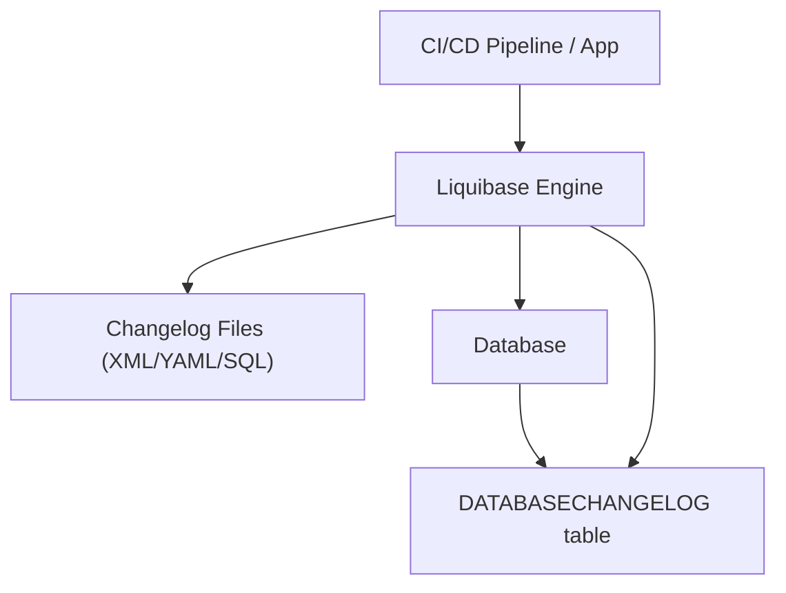

# Liquibase — Complete Explanation

## 1. What is Liquibase?

Liquibase is an open-source tool that helps you:

* Track database schema changes
* Version-control database evolution
* Apply changes automatically across environments
* Roll back changes safely
* Ensure consistency across Dev / QA / Prod

In simple terms:

> Liquibase is Git for your database, with enterprise-grade control.

---

# 2. Why Liquibase Exists

Without Liquibase:

```text id="liquibase_bad"
Developer writes SQL
   ↓
Manually executes in DB
   ↓
Different environments drift
   ↓
Production issues
```

With Liquibase:

```text id="liquibase_good"
Define changesets
   ↓
Liquibase tracks execution
   ↓
Applies only new changes
   ↓
All environments stay consistent
```

---

# 3. Core Concept: Changesets

Liquibase does NOT rely only on raw SQL files.

Instead, it uses **changesets**.

Example (XML format):

```xml id="changeset_xml"
<changeSet id="1" author="dev">
    <createTable tableName="users">
        <column name="id" type="int"/>
        <column name="name" type="varchar(100)"/>
    </createTable>
</changeSet>
```

You can also write in:

| Format | Type          |
| ------ | ------------- |
| XML    | most powerful |
| YAML   | readable      |
| JSON   | structured    |
| SQL    | traditional   |

---

# 4. How Liquibase Works

```txt id="flow_liquibase"
Application / CI Pipeline
        ↓
Liquibase Engine
        ↓
Reads changelog file
        ↓
Checks DATABASECHANGELOG table
        ↓
Applies only new changesets
        ↓
Updates tracking table
```

---

# 5. Liquibase Architecture



---

# 6. Key Components

## 6.1 Changelog File

Defines all schema changes.

Example:

```yaml id="yaml_example"
databaseChangeLog:
  - changeSet:
      id: 1
      author: dev
      changes:
        - createTable:
            tableName: users
```

---

## 6.2 DATABASECHANGELOG Table

Automatically created table:

```text id="history_table"
DATABASECHANGELOG
```

Stores:

* executed changeset ID
* author
* timestamp
* checksum (prevents tampering)

---

## 6.3 DATABASECHANGELOGLOCK

Prevents multiple deployments at same time.

---

# 7. How Liquibase Applies Changes

```txt id="apply_flow"
New changeset added
      ↓
Liquibase reads changelog
      ↓
Checks DATABASECHANGELOG
      ↓
Executes only new changesets
      ↓
Stores execution record
```

---

# 8. Rollback Support (Major Feature)

Liquibase supports **native rollback**, unlike many tools.

Example:

```xml id="rollback_example"
<changeSet id="2" author="dev">
    <addColumn tableName="users">
        <column name="email" type="varchar(255)"/>
    </addColumn>

    <rollback>
        <dropColumn tableName="users" columnName="email"/>
    </rollback>
</changeSet>
```

👉 This makes Liquibase very strong in enterprise systems.

---

# 9. Liquibase vs Flyway vs Atlas

| Feature         | Liquibase         | Flyway   | Atlas          |
| --------------- | ----------------- | -------- | -------------- |
| Schema format   | XML/YAML/SQL      | SQL only | Schema-as-code |
| Automation      | Medium            | Medium   | High           |
| Rollback        | Strong (built-in) | Limited  | Partial        |
| Drift detection | Basic             | None     | Strong         |
| Learning curve  | High              | Low      | Low            |
| Enterprise use  | Very high         | High     | Growing fast   |

---

# 10. Key Features of Liquibase

## 10.1 Multi-format support

* XML
* YAML
* JSON
* SQL

## 10.2 Rollback system

* Built-in rollback tags
* Step-wise undo

## 10.3 Change tracking

* DATABASECHANGELOG table
* checksums

## 10.4 Preconditions

Run changes only if conditions are met:

```xml id="precondition"
<preConditions>
    <tableExists tableName="users"/>
</preConditions>
```

---

# 11. Real Enterprise Usage

Liquibase is used in:

* banking systems
* insurance platforms
* government systems
* telecom infrastructure

Because it provides:

✔ strict auditing
✔ rollback safety
✔ compliance control
✔ change approval workflows

---

# 12. Advantages

* Very strong rollback system
* Supports multiple formats
* Enterprise governance features
* Safe for production systems
* Works with CI/CD pipelines


# 13. Disadvantages

* Complex setup
* Steep learning curve
* XML-heavy in traditional usage
* Slower than lightweight tools like Flyway

---

# 14. Simple Summary

> Liquibase is an enterprise-grade database change management tool that uses structured “changesets” to version, track, and safely deploy database schema changes with strong rollback and auditing capabilities.
