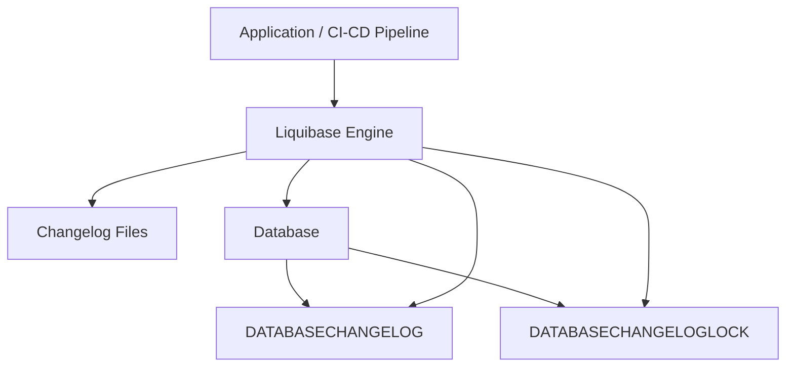

# Liquibase — Complete Detailed Explanation

## 1. What is Liquibase?

Liquibase is an open-source **database change management** and **schema migration** tool used to manage, track, version-control, and automate database changes across multiple environments.

It helps teams safely evolve databases in a controlled and repeatable manner.

Liquibase allows developers and DevOps teams to:

* Track database schema changes
* Version-control database evolution
* Apply changes automatically
* Synchronize Dev / QA / Staging / Production databases
* Roll back changes safely
* Maintain audit history of deployments
* Integrate database deployments into CI/CD pipelines

In simple terms:

> Liquibase is like Git for your database schema.

Just as Git tracks code changes, Liquibase tracks database structure changes.

---

# 2. Why Liquibase is Required

Modern applications constantly evolve.

As features grow, databases also change:

* new tables
* new columns
* indexes
* constraints
* relationships
* stored procedures

Without a migration tool, developers manually execute SQL scripts.

This creates major problems.

---

## 2.1 Problems Without Liquibase

```text id="liquibase_problem_flow"
Developer writes SQL
        ↓
Runs manually on local DB
        ↓
QA DB becomes different
        ↓
Production DB differs again
        ↓
Schema drift occurs
        ↓
Deployment failures happen
```

### Common Issues

## Environment Drift

Different environments have different schema versions.

Example:

| Environment | Schema              |
| ----------- | ------------------- |
| Dev         | users.email exists  |
| QA          | users.email missing |
| Prod        | old schema          |

Application crashes because schemas differ.

---

## Manual Deployment Errors

DBAs or developers may:

* forget scripts
* execute in wrong order
* skip indexes
* miss constraints

---

## No Audit History

Without tracking:

* nobody knows what changed
* no deployment history exists
* difficult to investigate failures

---

## Dangerous Rollbacks

If deployment fails:

* reverting changes manually is risky
* data corruption may occur

---

# 3. How Liquibase Solves These Problems

Liquibase introduces a controlled migration system.

Instead of manually executing SQL, developers define database changes as **changesets**.

Liquibase:

* tracks executed changes
* applies only new changes
* records deployment history
* prevents duplicate execution
* supports rollback operations

---

## Liquibase Workflow

```text id="liquibase_workflow"
Developer creates changeset
        ↓
Commit to Git repository
        ↓
CI/CD pipeline triggers Liquibase
        ↓
Liquibase checks database history
        ↓
Applies only new changes
        ↓
Updates tracking tables
        ↓
All environments stay synchronized
```

---

# 4. Core Concept — Changesets

The heart of Liquibase is the **changeset**.

A changeset represents a single database change.

Examples:

* create table
* add column
* create index
* add constraint
* insert seed data

Each changeset contains:

| Field    | Purpose           |
| -------- | ----------------- |
| id       | unique identifier |
| author   | developer name    |
| change   | DB operation      |
| rollback | undo operation    |

---

## Example Changeset (XML)

```xml id="changeset_example"
<changeSet id="1" author="dev">
    
    <createTable tableName="users">
        <column name="id" type="BIGINT">
            <constraints primaryKey="true"/>
        </column>

        <column name="email" type="VARCHAR(255)"/>
    </createTable>

</changeSet>
```

Liquibase records this execution permanently.

---

# 5. Supported Changelog Formats

Liquibase supports multiple formats.

| Format | Description           |
| ------ | --------------------- |
| XML    | most powerful         |
| YAML   | human-readable        |
| JSON   | structured            |
| SQL    | traditional SQL style |

---

## Example YAML

```yaml id="yaml_changeset"
databaseChangeLog:
  - changeSet:
      id: 1
      author: dev
      changes:
        - createTable:
            tableName: users
```

---

## Example SQL Format

```sql id="sql_changeset"
--liquibase formatted sql

--changeset dev:1
CREATE TABLE users (
    id BIGINT PRIMARY KEY,
    email VARCHAR(255)
);
```

---

# 6. How Liquibase Works Internally

Liquibase uses a changelog file and internal tracking tables.

---

## High-Level Flow

```text id="liquibase_internal_flow"
Application / CI Pipeline
            ↓
      Liquibase Engine
            ↓
 Reads Changelog Files
            ↓
Checks DATABASECHANGELOG
            ↓
Finds unapplied changesets
            ↓
Executes only new changes
            ↓
Updates tracking history
```

---

# 7. Liquibase Architecture



---

# High-Level Understanding

This architecture shows:

> How Liquibase reads migration files, checks database history, applies changes, and prevents concurrent deployments.

The diagram explains the complete lifecycle of database migration execution.

---

# Component-by-Component Explanation

---

# 1. Application / CI-CD Pipeline

```text
Application / CI-CD Pipeline
```

This is the starting point.

It represents:

* Spring Boot application startup
* Jenkins pipeline
* GitHub Actions
* GitLab CI
* Kubernetes deployment
* manual Liquibase execution

This component triggers Liquibase execution.

Example:

```bash
liquibase update
```

or during Spring Boot startup:

```properties
spring.liquibase.enabled=true
```

---

## Responsibility

Its job is:

* start deployment
* invoke Liquibase
* initiate schema migration

---

# 2. Liquibase Engine

```text
Liquibase Engine
```

This is the core processing engine.

It performs all migration logic.

---

## Responsibilities of Liquibase Engine

The engine:

### Reads changelog files

Example:

```text
master.xml
```

---

### Parses changesets

Example:

```xml
<changeSet id="1" author="dev">
```

---

### Connects to database

Using JDBC connection.

---

### Checks migration history

Reads:

```text
DATABASECHANGELOG
```

---

### Detects pending changes

Finds unapplied changesets.

---

### Executes migrations

Runs generated SQL.

---

### Updates tracking tables

Stores execution records.

---

# 3. Changelog Files

```text
Changelog Files
```

These are migration definition files written by developers.

They contain all database changes.

---

# What Exists Inside Changelog Files

Examples:

* create table
* alter table
* indexes
* constraints
* seed data
* rollback definitions

---

## Example

```xml
<changeSet id="2" author="dev">

    <addColumn tableName="users">
        <column name="email" type="VARCHAR(255)"/>
    </addColumn>

</changeSet>
```

---

# Why Changelog Files Matter

These files become:

> The source of truth for database schema evolution.

Instead of manually modifying DBs, all changes are version-controlled.

Usually stored in Git.

---

# 4. Database

```text
Database
```

This is the actual target database.

Examples:

* PostgreSQL
* MySQL
* Oracle
* SQL Server

Liquibase executes schema changes here.

---

# What Happens in Database

Liquibase may execute:

```sql
CREATE TABLE users (...);

ALTER TABLE users ADD COLUMN email;

CREATE INDEX idx_email;
```

---

# 5. DATABASECHANGELOG

```text
DATABASECHANGELOG
```

This is the most important internal Liquibase table.

Liquibase automatically creates it.

---

# Purpose

This table tracks:

* which changesets already executed
* execution timestamps
* checksums
* authors
* execution order

---

# Why It Exists

Without this table, Liquibase would not know:

```text
Which migrations already ran?
```

---

# Example Scenario

Suppose database already executed:

```text
changeset id=1
changeset id=2
```

Next deployment contains:

```text
1
2
3
4
```

Liquibase checks DATABASECHANGELOG and sees:

```text
1 → already executed
2 → already executed
3 → new
4 → new
```

So only:

```text
3 and 4
```

are executed.

This prevents duplicate execution.

---

# 6. DATABASECHANGELOGLOCK

```text
DATABASECHANGELOGLOCK
```

This table prevents concurrent migrations.

---

# Why Locking is Required

Imagine:

* two Jenkins jobs start simultaneously
* both attempt schema migration

Without locking:

```text
Race conditions
Partial execution
Schema corruption
Deadlocks
```

could happen.

---

# What Liquibase Does

Before migration starts:

Liquibase acquires lock.

```text
LOCK ACQUIRED
```

Other Liquibase processes must wait.

After migration:

```text
LOCK RELEASED
```
# Complete Execution Flow (Step-by-Step)

---

## Step 1

CI/CD pipeline starts deployment.

```text
Jenkins → Liquibase
```

---

## Step 2

Liquibase reads:

```text
master.xml
```

## Step 3

Liquibase checks:

```text
DATABASECHANGELOGLOCK
```

to ensure no other deployment is running.

---

## Step 4

Lock acquired.

---

## Step 5

Liquibase checks:

```text
DATABASECHANGELOG
```

to find executed migrations.

---

## Step 6

Liquibase identifies pending changesets.

---

## Step 7

Liquibase executes new SQL changes.

---

## Step 8

Liquibase records execution history.

---

## Step 9

Liquibase releases lock.

---

# Real-World Analogy

Think of Liquibase like a project manager.

---

## Changelog Files

```text
Project plan
```

Contains tasks to execute.

---

## DATABASECHANGELOG

```text
Completed tasks register
```

Tracks finished work.

---

## DATABASECHANGELOGLOCK

```text
Meeting room reservation lock
```

Prevents two managers changing plan simultaneously.

---

## Liquibase Engine

```text
Execution manager
```

Reads tasks and executes safely.

---

# Simple Final Understanding

The architecture diagram essentially shows:

> Liquibase acts as a controlled migration engine between deployment pipelines and the database.

It ensures:

* migrations execute once
* deployment history is tracked
* concurrent execution is prevented
* all environments remain synchronized
* schema evolution is automated safely

---

# 8. Important Internal Tables

Liquibase automatically creates two important tables.

---

## 8.1 DATABASECHANGELOG

Tracks all executed changesets.

Stores:

* changeset ID
* author
* filename
* checksum
* execution timestamp
* execution order

---

### Purpose

Liquibase checks this table before executing changes.

If changeset already exists:

```text id="skip_changeset"
Skip execution
```

If missing:

```text id="run_changeset"
Execute changeset
```

This prevents duplicate execution.

---

## 8.2 DATABASECHANGELOGLOCK

Used for deployment locking.

Purpose:

> Prevent multiple Liquibase processes from updating DB simultaneously.

Without locking:

* concurrent deployments could corrupt schema

---

# 9. Step-by-Step Execution Process

Suppose you add a new changeset.

---

## Step 1 — Liquibase Reads Changelog

```text id="step1"
master.xml
```

---

## Step 2 — Checks DATABASECHANGELOG

Liquibase verifies:

```text id="step2"
Has changeset already executed?
```

---

## Step 3 — Executes New Changes

If not executed:

```sql id="step3"
ALTER TABLE users ADD email VARCHAR(255);
```

---

## Step 4 — Records Execution

Liquibase inserts history record into:

```text id="step4"
DATABASECHANGELOG
```

---

# 10. Rollback Support (Major Enterprise Feature)

One of Liquibase’s biggest strengths is rollback capability.

Most migration tools mainly support forward-only migrations.

Liquibase supports explicit rollback logic.

---

## Example Rollback

```xml id="rollback_changeset"
<changeSet id="2" author="dev">

    <addColumn tableName="users">
        <column name="email" type="VARCHAR(255)"/>
    </addColumn>

    <rollback>
        <dropColumn tableName="users" columnName="email"/>
    </rollback>

</changeSet>
```

---

## Why Rollback is Important

If deployment fails:

* schema can revert safely
* downtime reduces
* production recovery becomes faster

---

# 11. Checksums and Change Integrity

Liquibase stores a checksum for every executed changeset.

Purpose:

> Detect unauthorized modifications.

If someone edits an already executed changeset:

```text id="checksum_error"
Checksum mismatch detected
```

Liquibase throws an error.

This protects migration integrity.

---

# 12. Preconditions

Liquibase supports conditional execution.

Example:

```xml id="preconditions_example"
<preConditions>
    <tableExists tableName="users"/>
</preConditions>
```

This means:

> Run migration only if users table exists.

---

## Why Preconditions Matter

Useful for:

* multi-tenant systems
* legacy DBs
* partial migrations
* safer deployments

---

# 13. Integration with CI/CD Pipelines

Liquibase is commonly integrated with:

* Jenkins
* GitHub Actions
* GitLab CI
* Azure DevOps
* Kubernetes deployments

---

## CI/CD Flow

```text id="cicd_flow"
Developer commits changeset
            ↓
Pipeline starts
            ↓
Liquibase update command runs
            ↓
Database upgraded automatically
            ↓
Application deployed
```

This enables fully automated DB deployments.

---

# 14. Liquibase Commands

---

## Update Database

```bash id="cmd_update"
liquibase update
```

Applies new changesets.

---

## Rollback

```bash id="cmd_rollback"
liquibase rollback
```

Reverts changes.

---

## Generate SQL Without Executing

```bash id="cmd_update_sql"
liquibase updateSQL
```

Useful for DB review/approval.

---

## Check Migration Status

```bash id="cmd_status"
liquibase status
```

Shows pending changes.

---

# 15. Typical Project Structure

```text id="project_structure"
db/
 ├── changelog/
 │    ├── master.xml
 │    ├── v1-init.xml
 │    ├── v2-users.xml
 │    ├── v3-orders.xml
 │    └── v4-indexes.xml
```

`master.xml` includes all migration files.

---

# 16. Liquibase vs Flyway vs Atlas

| Feature             | Liquibase         | Flyway     | Atlas          |
| ------------------- | ----------------- | ---------- | -------------- |
| Migration Style     | Changesets        | SQL files  | Schema-as-code |
| Formats             | XML/YAML/JSON/SQL | Mostly SQL | Declarative    |
| Rollback            | Strong            | Limited    | Partial        |
| Drift Detection     | Basic             | None       | Advanced       |
| Complexity          | High              | Low        | Medium         |
| Enterprise Features | Excellent         | Moderate   | Growing        |
| Learning Curve      | Steep             | Easy       | Moderate       |

---

# 17. Advantages of Liquibase

## Strong Rollback Support

Safe production rollback capability.

---

## Multiple Formats

Flexible migration styles.

---

## Audit Tracking

Full deployment history.

---

## Environment Consistency

Prevents schema drift.

---

## CI/CD Friendly

Automates database deployments.

---

## Enterprise Governance

Supports approval workflows and compliance.

---

# 18. Disadvantages of Liquibase

## Complex Configuration

Large setup compared to simpler tools.

---

## Steeper Learning Curve

XML/YAML syntax can feel verbose.

---

## More Overhead

Heavier than lightweight migration tools.

---

## Can Be Slower

Especially in massive enterprise schemas.

---

# 19. Real Enterprise Usage

Liquibase is heavily used in:

* banking systems
* telecom platforms
* insurance systems
* healthcare applications
* government infrastructure

Because enterprises require:

* auditability
* rollback safety
* deployment tracking
* compliance controls
* secure schema governance

---

# 20. Where Liquibase Fits in System Design

Liquibase sits between:

* application code
* deployment pipeline
* database infrastructure

It acts as the database deployment manager.

---

## Enterprise Deployment Architecture

```text id="enterprise_flow"
Developer
    ↓
Git Repository
    ↓
CI/CD Pipeline
    ↓
Liquibase
    ↓
Database
    ↓
Application Startup
```

---

# 21. Simple Mental Model

The easiest way to understand Liquibase:

> Liquibase is a database version-control and migration automation system that safely manages schema evolution across environments.

It is NOT just a SQL runner.

It is:

* schema versioning
* migration management
* deployment automation
* rollback system
* auditing platform

combined together.

---

# 22. Final Summary

Liquibase is an enterprise-grade database migration and schema versioning tool that helps organizations safely manage database evolution.

It works by:

* defining database changes as changesets
* tracking execution history
* applying only new changes
* maintaining consistency across environments
* supporting rollback and auditing

Liquibase is especially valuable in large enterprise systems where:

* reliability matters
* deployments must be repeatable
* rollback safety is critical
* audit tracking is required
* multiple environments must stay synchronized

In short:

> Liquibase brings DevOps-style automation, version control, and deployment safety to databases.
